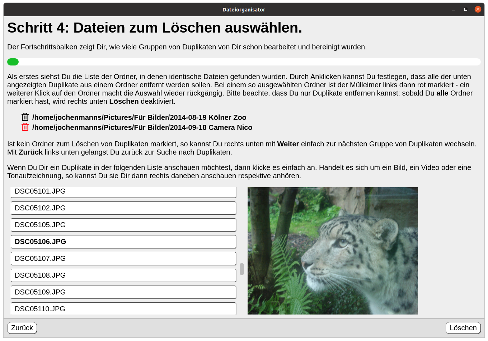

# Der Dateiorganisator

Tatsächlich ist das ein etwas großer Name für dieses kleine Werkzeug: es erfüllt eigentlich nur die Aufgabe, identische Dateien in einem Dateibaum zu ermitteln und dann eventuell Duplikate zu löschen. Die Bedienung ist bewußt einfach in einer Art Assistent / Wizard gehalten und sollte auch für unerfahrene Anwender einen erfolgreichen Einsatz ermöglichen.

Wie alle meine öffentlichen Projekte dient auch dieses als Lernprojekt für mich. Beruflich setzen wir schon lange auf [electron](https://www.electronjs.org/) als Basis für die Entwicklung plattformunabhängiger Anwendungen, dabei vor allem für Kiosksysteme. 

In diesem Projekt habe ich versucht mich in folgenden Aspekten etwas weiter zu entwickeln:
* Verwendung der aktuellen electron Version 9.
* Web Anwendung auf Basis von [webpack für electron](https://github.com/electron-userland/electron-webpack) - bisher habe ich bei electron Anwendungen auf Bundling gänzlich verzichtet.
* In diesem Kontext auch die Verwendung von [TypeScript](https://www.npmjs.com/package/electron-webpack-ts), SASS, CSS Modulen und React Lazy Components.
* Deployment für Linux und Windows über den [electron Builder](https://github.com/electron-userland/electron-builder) - hier ist aber noch Lernluft nach oben: unter Windows nur als *portable*, keine Icons etc.

Ganz interessant waren zum Beispiel die kleinen Tricks zum Zugriff auf lokale Dateien für die Vorschau (via *pathToFileURL*, *webSecurity*, *registerFileProtocol* und *decodeUriComponent*).

## Ausführbare Anwendung

[Linux](dist/File Organizer-1.0.0.AppImage)
[Windows](dist/File Organizer 1.0.0.exe)
